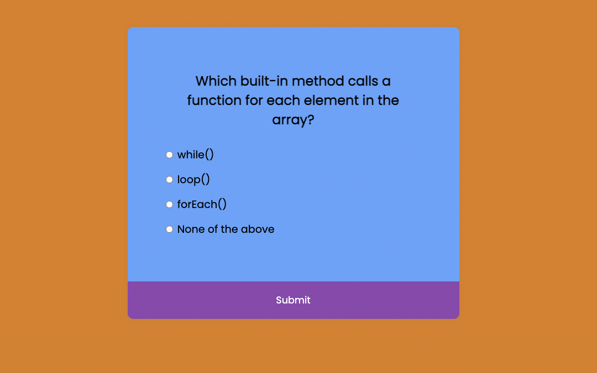

# ***Quiz App*** Javascript Project

> ### **Deployed Website** :-[Live Link](https://quizapp-jsp.netlify.app/)
 

This is a simple quiz app built with HTML, CSS, and JavaScript. The app presents a set of multiple-choice questions to the user, keeps track of the score, and allows the user to submit the answers and receive feedback.

## **Getting Started**
To run the quiz app, you can simply open the `index.html` file in a web browser. Alternatively, you can host the files on a web server and access the app via the URL.

## **Usage**
When the quiz app is launched, the user is presented with a multiple-choice question and four possible answers. The user can select one of the answers and move on to the next question by clicking the "Next" button. The app keeps track of the user's score and displays it at the end of the quiz.

## **Customization**

You can customize the quiz app by modifying the `quizData` array in the JavaScript file. The `quizData` array contains an array of quiz questions, each with a question text, four answer options, and a correct answer.

## **Contributing**
Contributions are welcome! If you find a bug or want to add a feature, feel free to open an issue or submit a pull request.

 
   

 
